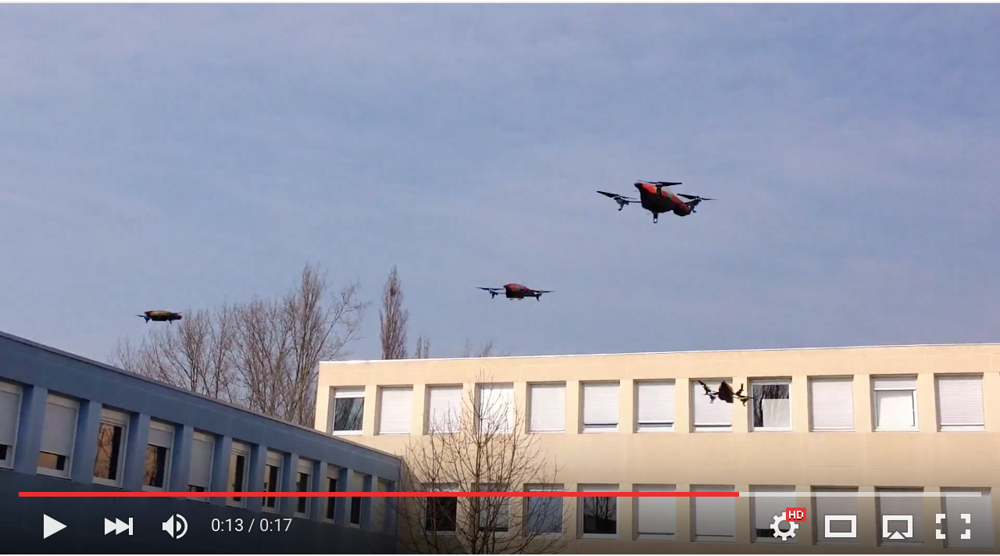

# multidrones

multidrones is a set of bash and expect scripts to connect and configure multiple [Parrot ar drones 2](http://ardrone2.parrot.com/) on the same unencrypted network.

## Contributors

Gildas Morvan - [mail](mailto:gildas.morvan@univ-artois.fr) - [homepage](http://www.lgi2a.univ-artois.fr/~morvan/)

with [Dylan Cossart](mailto:dylan_cossart@ens.univ-artois.fr), [Julien Jonathan](mailto:julien_jonathan@ens.univ-artois.fr), [Louis Mortreux](mailto:louis_mortreux@ens.univ-artois.fr) and [Nathan Planchez](mailto:nathan_planchez@ens.univ-artois.fr) from the department GEII of IUT de Béthune.

## Requirements

multidrones should run on OS X (Darwin) and Linux-based systems since **[Bash](http://tiswww.case.edu/php/chet/bash/bashtop.html)**, **[Expect](http://expect.sourceforge.net/)** and a **[Telnet](http://en.wikipedia.org/wiki/Telnet)** client are installed.


## Usage

To connect multiple ar drones, first edit the multidrones.sh file.
	
Set the name of the wifi interface of your computer using the variable `interface` (OS X: generally `en0` or `en1`; Linux : generally `eth0` or `eth1`). For instance: 


		interface=en1

Set the list of drone ids (last 6 digits of the drone  SSIDs) to connect to using the variable `ardronesnetworks`. For instance:

		declare -a ardronesnetworks=(090658 290876)

Specify the name of the unencrypted network you want to connect to using the variable network. For instance:

		network=DRONES

By default, the wifi access point IP address is supposed to be 192.168.1.1. The IP address of the computer that runs the script will be set to 192.168.1.2.
The drones IP addresses will be set to 192.168.1.3-x. It can be changed using the variable `ip`.

Then, authorize the scripts to be executed
	
        chmod a+x multidrones.sh multidrones.expect


Finally, run the main script

        ./multidrones.sh

You can now control all the drones at the same time using, e.g., using the [node.js ar-drone module](http://nodecopter.com/).

## Examples

The following code

```js
    var arDrone = require('ar-drone');
    var drones = [
        arDrone.createClient({ip: '192.168.1.3'}),
        arDrone.createClient({ip: '192.168.1.4'})
    ];
            
    drones.forEach(function(drone){
        drone.takeoff();
        drone.after(6000,function(){
            this.stop();
            this.land();
        });
    });
```

should give something like [this](example.mp4).


You can also make some flips.
[](https://youtu.be/y831UM1GfXM)
